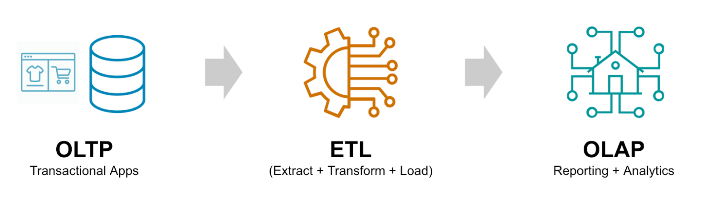
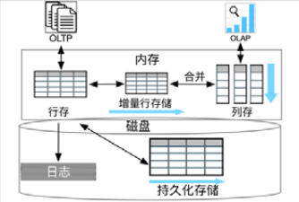
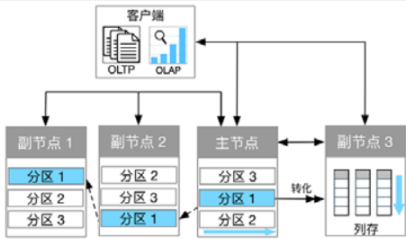
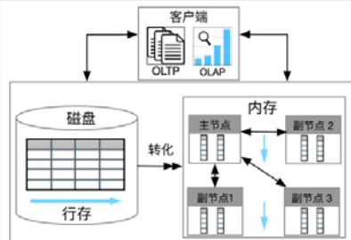
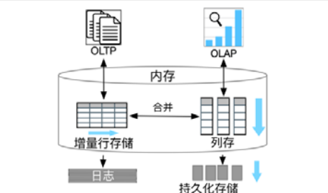

comments: true

# HTAP数据库简介

## 1. HTAP解决的问题
下图是经典的数据处理框架，包括两种数据库系统：一种是 **事务型的系统(on-line transaction processing，OLTP)** ，这是数据源头产生的地方；另一种是 **分析型的系统(on-line analysis processing，OLAP)** ，是我们的数仓。

数据会定期从交易型数据库中借助 **ETL(extract-transform-load，抽取-转换-加载)** 的方式流入到数仓. 然后在数据仓库做分析处理，产生相应的报表和报告。

随着现代社会中各类大规模实时分析应用的出现，许多的业务场景需要我们既能处理高并发的事务请求，又能够对最新数据作实时分析. 传统的数据处理流程耗时耗力，并且分析的数据往往已经过时，不能及时挖掘出有用信息.

因此最理想的情况是在数据产生后就能迅速对其进行分析。为了解决这个问题， HTAP系统应运而生，它的初衷就是要打破事务处理和分析处理的界限，使企业能够通过HTAP系统更好地发现市场反馈，获得更好的创新。

## 2. 按存储架构分类
在 HTAP 这一概念被正式提出之后，许多 HTAP 数据库应运而生，其中有传统数据库厂商通过扩展行存引擎或列存引擎实现，如：Oracle，SQL Server，DB2，SAP HANA.

也有各种专门面向 HTAP的数据库系统被提出，如：TiDB，F1 Lightning，MySQL Heatwave.

这些 HTAP 数据库的主要共同点是都以**行列存储共存**的方式来高效地处理混合负载. 这主要是因为:

 * 行存引擎更适用于高并发的行级别事务处理
 * 列存引擎更有利于分析查询处理，特别是对于查询只需要读取数据表的部分列的情况.

然而，由于OLTP 负载与OLAP负载的访问模式不同,且互相干扰，HTAP 数据库必须在负载隔离性与数据分析新鲜度之间做出取舍: 

 * 一方面，在**同一台机器**上处理混合负载会造成 OLTP与 OLAP的隔离性很低，但分析引擎能够快速读取最新事务数据，因此数据分析的新鲜度很高;  
 * 另一方面，**在不同机器上**分别处理 OLTP 与 OLAP 有很高的负载隔离性，但是由于数据同步的延迟会 造成分析的数据可能不是最新的.

根据存储架构的不同，将主流 HTAP 数据库的存储架构分为四大类，包括: 

1. 主行存与内存型列存
2. 分布式行存与列存副本
3. 单机磁盘型行存与分布式列存
4. 主列存与增量型行存

### 2.1 主行存与内存型列存

以行存为主存储，列存为内存型存储. 

行存引擎主要针对 OLTP 进行优化，负责高并发事务处理与写日志等操作，并持久化数据在磁盘中. 在数据更新时会将更新的记录同步到基于内存的增量行存储中.

基于主行存与内存型列存的 HTAP 数据库包括 DB2、Oracle、SQL Server。

### 2.2 分布式行存与列存副本

分布式行存为主存储，列存为只读副本。主节点在处理事务时写入日志，并异步地向其他节点服务器发送最新日志. 

通过分布式协议进行事务处理. 其中，有部分节点会被选为列存节点，负责加速复杂查询. 特别地，只有行存节点参与事务协议，列存节点不参与分布式事务投票. 当事务成功提交后，主节点将最新日志复制到列存节点，然后，列存节点将行数据转换成列数据后写入持久化存储. 

由于事务和查询分别在行存节点和列存节点上处理，该类系统具有高度的负载处理隔离性. 另外，由于完全基于分布式架构，该类系统面向 OLTP 和 OLAP 的 扩展性都很高. 

然而，相比于单机的 HTAP 架构，基于分布式的架构需要不断通信以保持不同节点间的数据 一致性，因此会产生较大延迟，所以，该类架构针对 OLTP 与 OLAP 的处理性能不高. 

另外，由于需要通过日志回放的方式同步行存节点与列存节点之间的数据，其在列存节点上进行数据分析时，可能有最新数据还未被转换合并到持久化的列存储，因而其数据分析的新鲜度偏低.

基于分布式行存与列存副本的 HTAP 数据库包括 TiDB、F1 Lightning等分布式数据库. 

### 2.3 单机磁盘型行存与分布式列存

该类系统以磁盘型行存数据库为基础，并集成了分布式内存型列存引擎. 主行存负责事务处理，分布式列存引擎则负责加速分析型查询. 最新的事务数据将被实时地更新到分布式列存中，以实现行存与列存之间的数据同步. 

该类系统通过行存型增量缓存实现列存数据更新，所以相较于日志型的 数据同步方式，有更高的新鲜度. 但是由于需要同时更新在不同机器上的列存数据，相较于在同一机器上的内存更新，其具有更低的新鲜度和更高的隔离性. 

因为其基于分布式列存储，所以该类系统有更高的 OLAP 吞吐量和更好的扩展性. 针对 OLTP 负载，其基于单机的行存数据库可提供适中的吞吐量和扩展性. 

该类系统需要解决的主要问题是: 当面临大规模更新时，由于 OLTP 的更新数据频繁地同步到分布式列存中，会极大地影响 OLAP 的分析性能，因此需要设计延迟更新机制以保证性能. 

然而，延迟地更新列存数据会影响到系统的数据分析新鲜度，因此，如何在分析性能与新鲜度之间做出合理的取舍是一个挑战.

### 2.4 主列存与增量型行存

该类系统以内存型主列存为基础，并结合了增量行存支持 HTAP. 主列存引擎 主要处理 OLAP 查询负载，增量行存引擎负责 OLTP 事务处理，并直接将更新数据定期合并到主列存中. 

该类系统因为以列存储为主，所以 OLAP 的处理性能很高，且增量行存直接与列存连接，数据分析的新鲜度也很高. 但其缺点也很明显，就是面向增量行存的 OLTP 处理性能中等，扩展性与负载隔离性很低. 

该类系统需要解决的主要问题是: 在保证 OLAP 分析的高性能与高新鲜度需要的同时，提高 OLTP 处理的性能与扩展性. 然而，解决该问题的难点是在同一台机器上处理 OLTP 负载与 OLAP 负载会互相干扰. 

因此，同时保证系统的 OLAP 与 OLTP 的高性能具有很大的挑战性.

该类架构具有代表性的系统是SAP HANA.

## 参考资料
[^1]: [深度解读HTAP系统的问题与主义之争](https://cloud.tencent.com/developer/article/1899868)
[^2]: 张超，李国良，冯建华，张金涛. HTAP 数据库关键技术综述. 软件学报，2023，34(2): 761–785. http://www.jos.org.cn/1000-9825/6713.htm