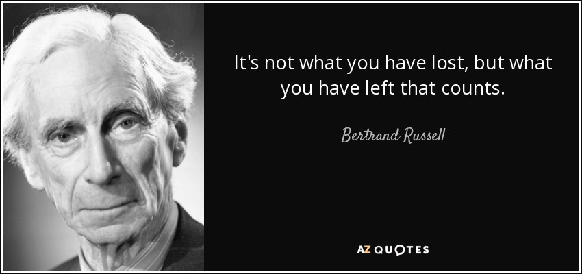

author: 忘筌
comments: true

# 不要迷失在细节中

原文出自：[忘筌的回答](https://www.zhihu.com/question/595969891/answer/3054501672)

任何活儿，无论是存储、网络、AI Infra、编译器后端、CUDA，等等，都非常简单。外表高大上，看着是宾利的壳，其实核心动力是几个老鼠在壳里面蹬三轮呢。只要你干一两年基本都懂了。

你能把活儿干出花来，能快速的超越自己的限制，最重要的是计算机各个领域的基本视野和概念。

你必须知道计算机科学几乎所有的领域基本的想法是什么。比如 TCP 怎么维护虚拟链接传递信息，如何做微观的拥塞控制；编译器怎么解析出IR代码，如何对IR代码优化；分布式算法如何协调工作；流式计算里面 Unbounded Data 怎么做 window/trigger；机器学习里面各种模型是如何拟合数据的，为什么需要不同的拟合方式；MySQL 中事务怎么做，行锁怎么设计的；Linux kernel 的进程调度怎么设计、异步 io 怎么设计……

有了这些视野之后，你要把它们从具体的领域中抽象成概念。

千万不要把自己的精力放在“TCP 包头几个字节都是什么”、“C++ 17 引入了什么”之类的细枝末节，除非你决定把你的事业投入到上面。

概念就是计算机科学最精华的部分，你必须学会在不同的领域复用这些概念，这样你就是有"insight"的。比如要写一个最简单的业务，你一定会遇到事务、parse 配置规则、限流控制、调度这些问题，是否有一些策略可以采样训练模型自动优化……

你能否把学到的概念，结合实际应用起来，这个才是工程师的意义所在。

什么时候能惊艳你的概念越来越少，到最后你看绝大部分东西的时候都能说出“就这”，你就是合格的工程师了。

