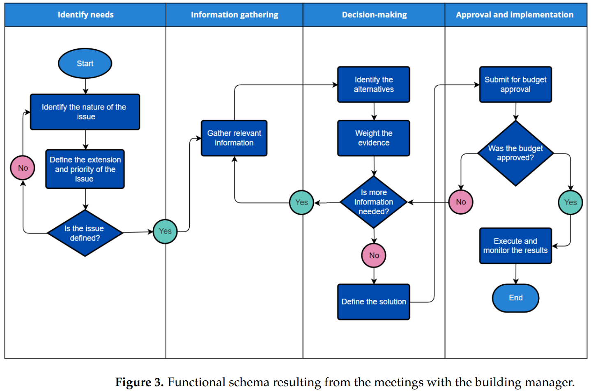
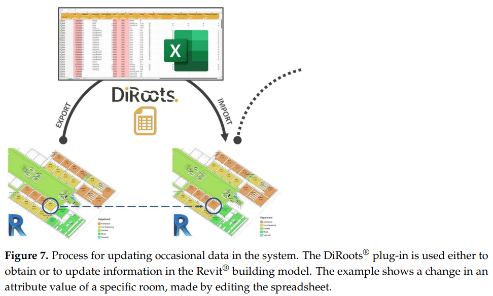
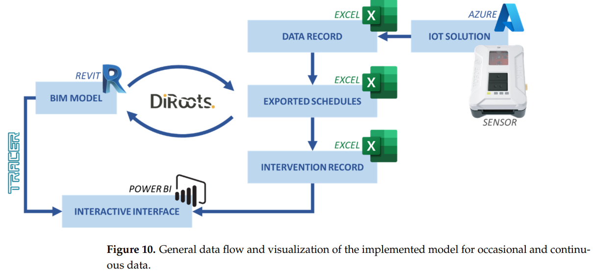
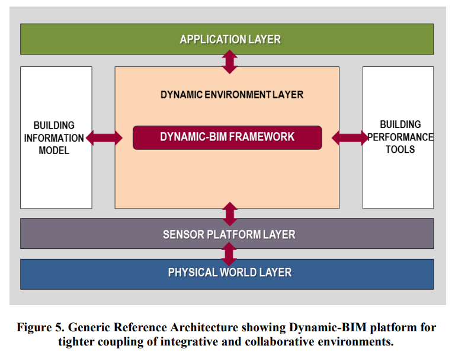
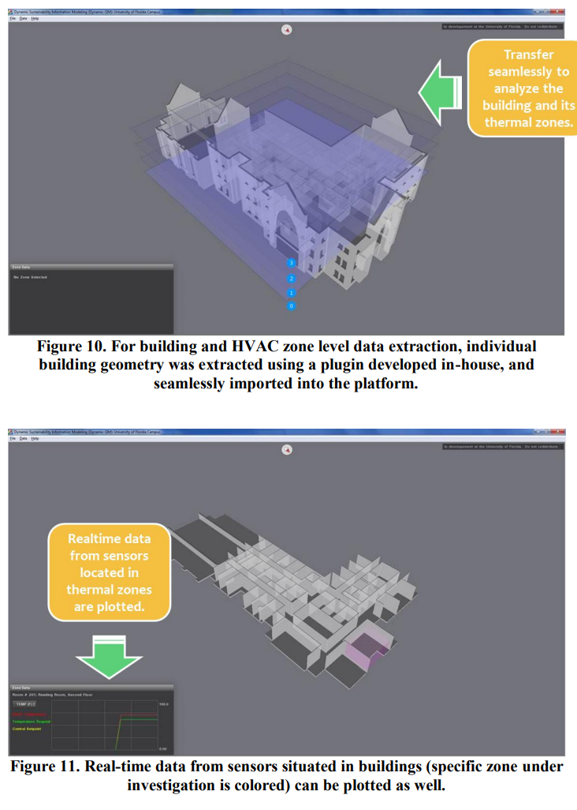
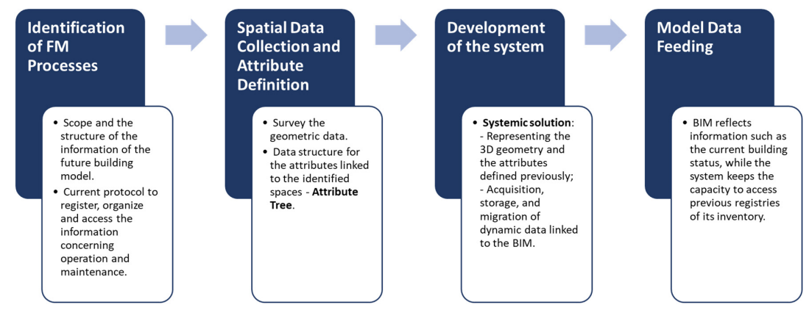
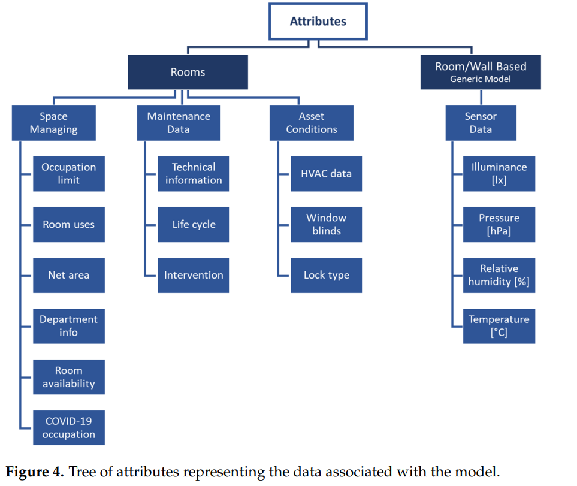

comments: true

## 1.问题背景

### 1.1传感器数据
由于数字传感器价格的下降和处理大数据流的计算机能力的提高，在建筑中使用嵌入式智能，也就是所谓的智能建筑。无线传感器网络（WSN）技术在建筑环境资产的后期管理中获得了突出的地位，与BIM方法相联系。WSN结合了空间分布的自主设备或传感器的无线网络，以提供对物理或环境条件的实时监测。如今，大多数最新的建筑都配备了室内环境传感器，主要用于收集保护或用于能源可持续性评估和舒适性分析。环境和声学传感器可以提供有关建筑物占用情况和建筑物实时所处环境条件的宝贵信息。然而，由于数据集的大小、详细程度以及与现有格式的互操作性等挑战，数据评估的自动化还没有得到适当的实施。关于BIM和物联网（IoT）的整合，大多数研究主要是理论和概念性的或面向原型解决方案的。[^ref1]

BIM在现有的环境中存在一些局限性，如：工具和技术的瓦解：静态和/或单一用户环境：缺乏一个基于刚刚应用的可持续性概念的系统，等等。本章讨论了动态BIM平台的发展，这是一个多用户的集成、协作和可扩展的环境，能够实现能源和环境影响。[^ref4]

在基于BIM的设施管理过程中，使用传感器的传统建筑会面临一些重大挑战，例如，当建筑具有遗产价值时，难以以非侵入性的方式安装传感器，或者难以确保在三维平台上实时整合传感器收集的数据，例如，在人口密集和密集使用的建筑中的环境和声音传感器。[^ref1]

### 1.2需要解决的问题
目前，BIM中建立的实时反馈方法完全与建筑项目管理的更新有关，如项目状态，因此，目前的BIM环境可能被视为 "静态的"。 换句话说，虽然BIM包括一个巨大的建筑结构数据库，但它并不活跃，不足以对建筑进行评估，包括实时实施传感数据和/或控制算法。这种方法可以为建筑和环境的可持续性提供优化的解决方案，以及综合能源和环境评估。随着BIM被建筑师和工程人员广泛采用，必须承认，连续的可视化和监测与BlM框架相结合的实时反馈系统是必要的。对BlM的 "动态 "方法是必不可少的，不仅要直观地跟踪材料和能源流，而且要对状态变化作出反应，以便立即反馈和采取行动。[^ref4]

大多数情况下，BIM文件通常在施工后被搁置。为了延长BIM的寿命，并在一个单一的平台上解决整合的问题，我们提出并开发了一个新的动态BlM平台。

需要做更多的工作来扩展BIM的能力，以进行与能源工程相关的详细性能分析，如使用每小时的能源模拟算法进行能源估算，特别是EnergyPlus，因为其功能广泛；用于设计决策的三维共轭热和气流分析；数据分析和可视化，等等。

## 2.传统方法
Galiano-Garrigós和AndújarMontoya提出了一个在大学建筑运营和维护范围内的BIM-FM整合的理论框架：该研究强调了采用BIM和FM的重要性，以利用智能传感器等新兴技术进行数据采集，提供更有效的维护。在阿利坎特大学校园内的一栋建筑中，对所提出的范式的适用性进行了案例研究，证明了其作为一个综合系统的可行性和潜力，可以在参与建筑维护的各利益相关方之间获取和分享信息。

卡利亚里大学的一个展馆的传感器-BIM集成解决方案使用了一个数据平台[^ref2]，通过BIM接口（Revit）获取了几个测量的室内建筑条件，如温度、亮度和能源消耗参数。这个模型和来自传感器的数据的整合是基于Dynamo可视化编程，用传感器获取的数据填充BIM。该解决方案的目标是提供评估建筑的舒适度和能源效率的手段，促进能源审计程序。[^ref1]

Villa等人（[^ref3]）提出了一个由物联网传感器和BIM平台组成的全自动框架，以支持都灵理工学院实验室的预防性维护。集成的物联网和BIM架构不仅显示了其在预防异常方面的适用性，而且还促进了与建筑管理者的沟通，为利用实时数据做出更好的决策提供了支持。

更大的工具集成，特别是实时物理传感器、执行器、控制器和控制算法，将实现即时模拟，可用于设计、操作和维护低能耗建筑及其他。换句话说，使用动态BIM框架进行全面调试是可行的，可以节省大量的时间和精力。在虚拟环境中对建筑及其系统进行可视化、分析和控制，将使大部分必要的调试过程得以轻松进行。这不仅延长了BIM "建成 "后的寿命，而且为进行持续的调试提供更大的灵活性。此外，目前，动态BIM原型和Ptolemy之间的通信是通过同一台机器上的端口实现的。随着我们的进一步发展，端口方法有可能被扩展到不同机器之间通过互联网进行通信。这种方法可以使动态BIM在便携式设备中运行，以支持虚拟调试（vCx）和虚拟连续调试（VCCx）以及现有建筑的故障检测。其他动态BIM框架的应用包括被动式太阳能建筑设计和施工；净零建筑的设计和施工；现有建筑的实时能源分析；以及建筑能源性能的自动校准等等。

### 2.1基于Excel和DiRoots的集成方案

通过Autodesk Revit@的DiRoots插件，将带有房间和资产可编辑信息的时间表导出为Microsoft ExcelD工作表格式（*.xlsx）（34）。同时，为了满足对干预的历史记录的需要，一个VBA脚本使所有的数据被保存并登记在不同的工作簿中，允许使用常规的MicrosofExcel功能来查询和过滤数据集。关于数据管理，BIM数据库的编辑不是直接使用Revito，而是使用与模型相连的电子表格。只有在经理对报告中的输入数据的内容和质量进行核实后，才对数据进行更新（图7）。

为了将传感器数据纳入系统，这些设备通过使用微软Azure平台的Wi-Fi网络连接，其中包括一个loT（物联网）解决方案。[^ref1]数据在Azure平台上被注册和可视化，并被导出到Microsoft Excel电子表格中，其中包含所有的数据记录。在Revit模型中更新数据的过程中，创建了一个代表传感器格式和位置的通用元素。在环境数据的电子表格中，一个VBA脚本提取了一系列的统计数据，例如，每个参数的最后值或它们的每日平均值，并将这些值存储在文件中。更新过程与用于偶发数据的过程类似，允许BIM模型被输入测量值。

对于偶然的数据，如果，例如，"部门信息 "属性值区域的变化是因为某个房间改变了用途，必须在属性列表中确定该房间，并且必须使用DiRoots插件保存和导出该变化，以更新BIM数据库。如果需要，视觉界面也可以通过导出更新的BIM数据库（JSON）并将其加载到Power Bl中进行更新。

### 2.2 Dynamic-BIM 平台
动态BIM平台[^ref4]，这是一个多用户的集成、协作和可扩展的环境，可以对建筑和环境进行能源和环境影响分析和可视化。该平台采用了机构参考架构，适用于建筑及其环境的综合和协作环境的紧密耦合。此外，本章还讨论了该平台的三个应用：（1）佛罗里达大学校园建筑的原型实施，其中能源数据（电力、冷水、蒸汽和水）是可视化的；（2）佛罗里达大学校园内教育建筑的原型实施，其中数据是实时收集和可视化的。

此外，该平台为建筑能源工程教育提供了急需的动态和互动平台的框架。该平台使用一个通用的参考架构，适用于建筑及其环境的综合和协作环境的更紧密耦合。该平台的一个扩展版本跟踪了校园建筑使用的所有类型的能源，代表了一个*校园能源地图

动态BIM平台使用一个通用的参考架构，适用于建筑及其环境的集成和协作环境的紧密耦合。它由四层组成：物理世界层；传感器平台层；动态环境层；和应用层，图5。建筑物和它们的环境是物理世界层的一部分。传感器平台层实现了对物理世界层中可移动系统的感应和激活。其中最关键的是动态环境层，它容纳了下一节中讨论的动态BIM平台。最后，应用层利用图形用户界面在用户和系统之间架起桥梁。

目前正在开发用电检查方案，包括：(a) 焓值（外部和使用）评估，(b) 摄氏度日正常化和分析，(c) 建筑物层面的能源使用强度，(d) 空间使用类型的能源使用强度，(e) 平均能源使用，(f) 其他用途，如外部/街道照明、游泳池加热等，用于电力消费和需求。除了电力，其他能源使用（冷冻水、水、蒸汽、天然气、燃料）、能源（光伏、光热、风能、水电）、废水等都将使用该系统进行分析。动态BIM环境和平板电脑中内置的陀螺仪和加速度计使校园建筑的导航，包括在建筑上方 "飞行"。未来的工作将测试移动技术的使用，特别是平板电脑，以 "在建筑物上点射 "来进行能源分析。

### 现有方法的问题
使用BIM软件管理建筑需要专业的知识，而建筑运营和管理所涉及的技术专业则需要BIM专家。因此，为了保证模型的实用性，通过连接到BIM模型的用户友好工具来访问和更新模型是至关重要的。通过电子表格和交互式仪表板实现双向数据流，以简单的界面促进模型的输入和输出，有明显的好处。

在几何学方面，使用BIM可以定义不同层次的空间颗粒，从一个点（例如，由墙/房间的坐标定义）到由墙、地板和其他元素定义的房间。这有利于将准确的位置数据与模型联系起来，例如，当需要将传感器定位在一个特定的点上，而不是笼统地定位在一个房间或一面墙上。然而，复杂的空间情况仍然给建模者带来重大挑战，必须通过制定更复杂的属性数据结构加以解决。例如，如果一个房间有两个不同用途的内部区域，就有必要通过扩大属性树或使用创造性的几何构件来反映这一点，例如将空间分成两个没有隔断墙的房间。

尽管所提出的方法有很多优点，但也有一些局限性，比如需要遵守外部信息的数据结构，用户必须遵守数据格式要求，以便能够将数据导入BIM中。此外，模型的几何形状的变化，例如分割或合并相邻的房间，意味着从改变的空间中重新分配属性，并重新定义与外部数据库结构的联系。

## 3.研究思路
### 3.1 一般流程

**识别设施管理流程。**识别当前的设施管理和维护工作流程对于确定未来建筑模型的范围和信息结构是必须的。在当地维护团队的帮助下，这一阶段的成果必须是项目的范围，其功能要求，以及与这些要求相适应的三维模型和数据的详细水平。此外，还有必要了解目前登记、组织和获取有关运行和维护信息的协议。这包括调查可用的和预定的数据来源和格式，数据更新的频率，所有相关技术人员在数据访问方面的用户情况，以及他们活动之间的关系。在此基础上，必须为系统中的信息流定义一个通用的功能模式。 必须被定义。[^ref1]

**空间数据的收集和属性的定义。**用于测量几何数据的技术的重要性在于项目所需的详细程度。现有的计划和/或专门的空间数据采集，例如，使用地面激光扫描并辅以现场测量，可以支持三维建设。此外必须根据上一阶段决定的背景，为与确定的空间相关的属性建立一个适当的数据结构。这将产生一个空间数据源清单和一个属性树，作为建筑模型开发的基础。|

**摄取有关操作和维护的信息。**这包括调查可用的和预期的数据来源和格式、数据更新的频率、所有相关技术人员的数据访问方面的用户情况，以及他们活动之间的关系。在此基础上，必须为系统中的信息流定义一个一般的功能模式。空间数据的收集和属性的定义。用于调查几何数据的技术的重要性在于项目所需的细节水平。现有的计划和/或专门的空间数据采集，例如，使用地面激光扫描并辅以现场测量。这个阶段的交付成果是一个系统性的解决方案，包括一个基于现有几何信息的BIM模型，具有预定的复杂程度，并遵循定义的属性规范，以及在APl下与BlM连接的附加程序，实现之前定义的功能要求。

**模型数据的输入。**具体到调控目的，BlM模型反映的信息很重要，如当前的建筑状态，同时系统保留了访问以前库存登记册的能力。根据采集模式和更新频率等方面，向系统输入数据可以是自动的，也可以是手动的。模型的几何形状和属性可以直接在BIM软件中进行编辑，这项活动通常由BlM专家来完成。然而，属性也可以通过已建立的APl进行修改，非BIM专家的用户可以编辑存储在与BIM模型相连接的数据源中的信息，通过激活数据更新工具，BIM元素的属性也会相应改变。

### 3.2 数据分类
与建筑物的图形表示有关的信息被安排成四组： "空间管理"、"维护数据"、"资产状况 "和 "传感器数据"。这些信息组可以根据它们的变化频率分为两类：前三组包括零星变化的数据，在此称为 "偶然数据"，而来自传感器的数据被称为 "连续数据"。[^ref1]

## 参考文献
[^ref1]: Dynamic Data Feeding into BIM for Facility Management - A Prototype Application to a University Building.
[^ref2]: Desogus, G.; Quaquero, E.; Rubiu, G.; Gatto, G.; Perra, C. BIM and IoT Sensors Integration: A Framework for Consumption and Indoor Conditions Data Monitoring of Existing Buildings. Sustainability 2021, 13, 4496.
[^ref3]: Villa, V.; Naticchia, B.; Bruno, G.; Aliev, K.; Piantanida, P.; Antonelli, D. IoT Open-Source Architecture for the Maintenance of Building Facilities. Appl. Sci. 2021, 11, 5374.
[^ref4]: Dynamic Building InformationModeling (DynamicBIM): An Interactive Platform for Building Energy Engineering Education
